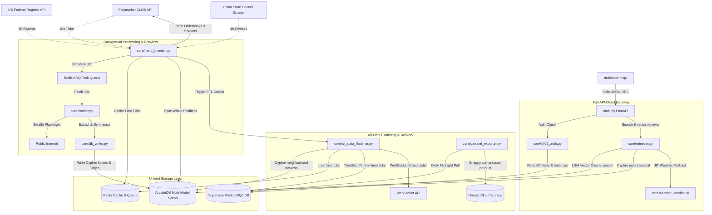

# System Architecture & Component Mapping

This document outlines all the active components, files, database schemas, and caching layers that make up the Dubstrata B2B Alt-Data and Causal RAG platform. Use this document as a manual blueprint to trace data flows, dependencies, and component relationships.

---

## 🗺️ System Blueprint & Data Flow



---

## 📦 Directory Structure & Component Matrix

### 1. The API Gateway & Authentication Layer
* **[main.py](file:///c:/Users/muzik/Documents/GitHub/dubstrata/main.py):** The primary FastAPI gateway. Serves all REST endpoints, WebSocket connections (`/api/v1/ws/alerts`), handles API key/hybrid auth checks, and credit deductions.
* **[core/jwt_auth.py](file:///c:/Users/muzik/Documents/GitHub/dubstrata/core/jwt_auth.py):** Generates and validates JSON Web Tokens (JWT) for B2B API session validation, and exposes endpoints/helpers for cryptographically rotating secrets.
* **[core/x402_auth.py](file:///c:/Users/muzik/Documents/GitHub/dubstrata/core/x402_auth.py):** Implements Web3 hybrid auth. Resolves and validates Solana signature payloads against RLS accounts for pay-as-you-go agent requests.
* **[core/mtls_validator.py](file:///c:/Users/muzik/Documents/GitHub/dubstrata/core/mtls_validator.py):** Extracts and validates client X.509 certificates to support mutual TLS (mTLS) handshakes on enterprise routes.

### 2. Caching & Causal Graph RAG Retrieval
* **[core/db.py](file:///c:/Users/muzik/Documents/GitHub/dubstrata/core/db.py):** Setup connection wrapper for ArcadeDB HTTP API. Exports `driver` session client.
* **[core/db_writer.py](file:///c:/Users/muzik/Documents/GitHub/dubstrata/core/db_writer.py):** Graph database serialization engine. Maps Pydantic substrates (Entities, Claims, Documents) to ArcadeDB Cypher queries, with automatic Multi-Version Concurrency (MVCC) write retries and exponential backoff.
* **[core/retriever.py](file:///c:/Users/muzik/Documents/GitHub/dubstrata/core/retriever.py):** The retrieval brain. Combines LSM vector search, graph traversals, JIT weather crawlers, live market price fetching, and hybrid SQL select fallbacks to fetch narrative context blocks.
* **[core/schema_validator.py](file:///c:/Users/muzik/Documents/GitHub/dubstrata/core/schema_validator.py):** Pydantic validators enforcing exact property mappings, sentiment, and confidence scoring.
* **[core/weather_service.py](file:///c:/Users/muzik/Documents/GitHub/dubstrata/core/weather_service.py):** Just-In-Time (JIT) crawler fallback service. Geocodes and retrieves Open-Meteo climate data when matching facts are missing.
* **[prompts/deconstruction.md](file:///c:/Users/muzik/Documents/GitHub/dubstrata/prompts/deconstruction.md):** System prompt defining deconstruction rules, causal graph attributes, and prediction market node mappings.

### 3. Sensors, Markets & Consensus Engine
* **[core/polymarket_client.py](file:///c:/Users/muzik/Documents/GitHub/dubstrata/core/polymarket_client.py):** Async API client pulling CLOB book order data, bids, asks, and holder balances.
* **[core/polymarket_consensus.py](file:///c:/Users/muzik/Documents/GitHub/dubstrata/core/polymarket_consensus.py):** Ranks orderbook and wallet profiles by capital exposure, computing Consensus Sentiment Index (CSI).
* **[core/consensus.py](file:///c:/Users/muzik/Documents/GitHub/dubstrata/core/consensus.py):** Implements weighted consensus algorithms, aggregating multiple sentiment signals into a single score.
* **[core/financial_service.py](file:///c:/Users/muzik/Documents/GitHub/dubstrata/core/financial_service.py):** Unified real-time price feed engine. Fetches spot quotes from Binance Spot API (cryptocurrencies) and Yahoo Finance Chart API (equities, forex, commodities).

### 4. B2B Alt-Data transformation ("Dining Room")
* **[core/alt_data_flattener.py](file:///c:/Users/muzik/Documents/GitHub/dubstrata/core/alt_data_flattener.py):** The ETL service that flattens graph structures, joins Redis ticks (including orderbook depth, spreads, and holder concentrations), runs write-throttling, and inserts point-in-time records into Supabase.
* **[core/parquet_exporter.py](file:///c:/Users/muzik/Documents/GitHub/dubstrata/core/parquet_exporter.py):** Generates snap-compressed Parquet files of the past 24 hours of alt-data and pushes them to GCS. Requires `GOOGLE_APPLICATION_CREDENTIALS` and `GCS_BUCKET_NAME` environment variables.

### 5. Background Daemons, headles foragers & Cleanups
* **[core/trend_monitor.py](file:///c:/Users/muzik/Documents/GitHub/dubstrata/core/trend_monitor.py):** Resilient APScheduler loop that polls Polymarket, checks RSS feeds, crawls gazettes, and drives the flattener sweeps.
* **[core/regulatory_crawler.py](file:///c:/Users/muzik/Documents/GitHub/dubstrata/core/regulatory_crawler.py):** Pulls from the US Federal Register and China State Council.
* **[core/worker.py](file:///c:/Users/muzik/Documents/GitHub/dubstrata/core/worker.py):** Headless foragers executing asynchronous scraping jobs using Playwright Stealth.
* **[core/clean_empty_documents.py](file:///c:/Users/muzik/Documents/GitHub/dubstrata/core/clean_empty_documents.py):** Maintenance script that identifies and deletes unreferenced Document vertices (0 claims pointing to them) from the graph database.
* **Startup Daemons (APScheduler):** Implements background daemons inside `main.py` triggered on startup:
  * `scheduled_empty_docs_cleanup`: Triggers `purge_dead_documents()` daily.
  * `scheduled_jwt_secrets_rotation`: Triggers key rotation protocols daily.

### 6. Relational Database & Telemetry Layer
* **[core/telemetry.py](file:///c:/Users/muzik/Documents/GitHub/dubstrata/core/telemetry.py):** Core SaaS telemetry helper. Dispatches fire-and-forget background threads to record billing updates, RLS violations, and processing performance metrics into Supabase.
* **[database/supabase_init.sql](file:///c:/Users/muzik/Documents/GitHub/dubstrata/database/supabase_init.sql):** Schema containing Postgres tables (`tenants`, `tenant_users`, `api_keys`, `api_usage_logs`, `x402_receipts`, `alt_data_time_series`, `processing_performance_logs`), Row Level Security policies, and onboarding triggers.

---

## 📡 Live Running Setup

To get data streaming into Supabase (`alt_data_time_series`), the background components must be running.

### 1. Spin up Core Containers (ArcadeDB & Redis)
Ensure ArcadeDB and Redis are active:
```powershell
docker-compose up -d
```

### 2. Boot the Background Daemon (`trend_monitor.py`)
This script schedules Polymarket scraping and drives the ETL flattener sweeps every 10 seconds:
```powershell
python core/trend_monitor.py
```

### 3. Run the FastAPI Cloud Gateway (`main.py`)
This starts the Web server serving the REST endpoints and driving WebSocket connections:
```powershell
uvicorn main:app --reload
```
