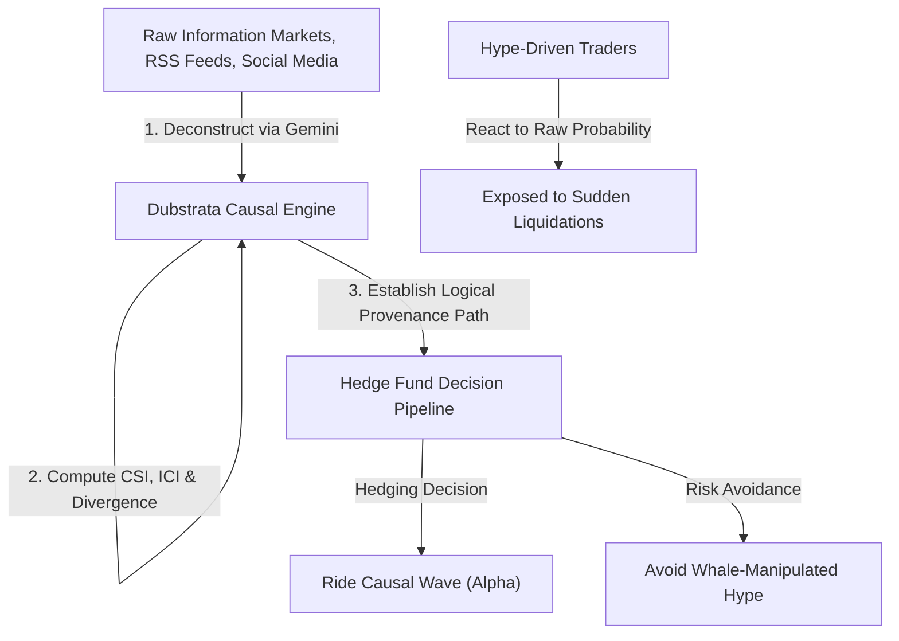

# Amended Business Plan: Dubstrata

**The Multi-Tenant Alternative Data Engine & Agentic CDN for Causal Financial Truth**

*Stage:* Pre-Seed (0 Users)  
*Date:* June 17, 2026  
*Document Version:* 1.2 (Amended via Investor Feedback)

---

## 1. Executive Summary

### The Opportunity

In modern finance, alpha is not merely the size of a return; it is the verifiable difference in strategy between institutional funds and hype-driven retail traders. Prediction markets (e.g., Polymarket) are the ultimate real-time information aggregators, but their raw signals are highly distorted by whale concentration and lack contextual logical proof.

**Dubstrata** bridges this gap by acting as a high-performance **Alternative Data Engine & Agentic CDN**. It deconstructs unstructured market signals, runs graph-based causal verification, matches trader profiles to detect "whale manipulation," and exposes a multi-tenant API and real-time WebSocket streams for quantitative investors, algorithmic traders, and agentic developers.

### Strategic Objectives

1. **Developer-First Acquisition**: Grow from 0 to 100 enterprise developers and 30 active fund subscriptions in Year 1 using a utility-billing API and high-ticket WebSocket streams.
2. **Graph Expansion**: Synthesize over 10 million distinct causal facts, claims, and entity edges across ArcadeDB and Supabase.
3. **Pre-Seed Funding Target**: Raise **$750,000** to fund engineering, API infrastructure, database scale-up, and regulatory compliance.

---

## 2. Problem Statement & Market Opportunity

### The Problem

* **Unstructured Information Chaos**: Financial reports, regulatory updates, and prediction trends are scattered in non-standardized feeds.
* **Whale Manipulation in Prediction Markets**: A small number of high-capital wallets distort market probabilities, causing false signals.
* **Lack of Causal Justification**: AI agents and quantitative algorithms receive numerical probabilities without the structural "why" (supporting claims, evidence links, and trust decay metrics).
* **Alpha Erosion via Information Parity**: As standard data sources are democratized, traditional alpha decays to zero. Access to unique, low-latency alternative indicators is the only way to establish true strategic differentiation.
* **Contextual Blindspots in Algorithmic Pipelines**: Quantitative models make decisions based on statistical correlations without tracking real-time regulatory policies, leading to blindside risks during structural regime shifts.

### Strategic Portfolio Differentiation (Verifiable Logic vs. Hype)

Modern quantitative funds build portfolios around the minimization of risk effects rather than responding to raw possibilities. Dubstrata enables funds to hedge against sudden shifts by parsing the causal relationship network of a market, separating speculative hype from structural consensus:



### The Market Sizing (TAM, SAM, SOM)

* **Total Addressable Market (TAM)**: Global Alternative Data Market (projected to reach **$154.3 Billion** by 2030, growing at a 54.4% CAGR).
* **Serviceable Addressable Market (SAM)**: API-delivered quantitative data feeds for hedge funds, venture capital, and Web3 trading desks (**$8.5 Billion**).
* **Serviceable Obtainable Market (SOM)**: Enterprise developers building financial AI agents and prediction market arbitrage bots (**$85 Million** within 3 years).

---

## 3. Product & Technology Architecture

Dubstrata is built on a robust, highly optimized stack designed for maximum data throughput, security, and low-latency API delivery:

```
        ┌─────────────────────────────────────────────────────────────────┐
        │                          Data Sources                           │
        │ (Polymarket CLOB, Sovereign Gazettes, RSS Feeds, Social Media)  │
        └────────────────────────────────┬────────────────────────────────┘
                                         │
                                         ▼
        ┌─────────────────────────────────────────────────────────────────┐
        │            Worker Nodes (Arq, Playwright, Crawl4AI)             │
        └────────────────────────────────┬────────────────────────────────┘
                                         │
                                         ▼
        ┌─────────────────────────────────────────────────────────────────┐
        │              Gemini AI Deconstruction Pipeline                  │
        └────────────────────────────────┬────────────────────────────────┘
                                         │
        ┌────────────────────────────────┴────────────────────────────────┐
        ▼                                                                 ▼
 ┌─────────────────────────┐                               ┌─────────────────────────┐
 │ ArcadeDB (Graph Engine) │                               │    Supabase (Postgres)  │
 │ - Entities & Claims     │                               │ - Time Series Alt Data  │
 │ - Multi-Tenant RLS      │                               │ - Utility Billing Meter │
 └─────────────────────────┘                               └─────────────────────────┘
```

### 3.1 Data Sourcing & Regulatory Hedging

To mitigate single-point-of-failure risks associated with prediction market bans, Dubstrata ingests a highly diversified array of alternative data feeds:

* **Prediction Event Markets**: Real-time pricing, order book spreads, and volumes from platforms like Polymarket.
* **Sovereign Regulatory Gazettes**: Active, automated crawls of the US Federal Register, EU publications, and Asian state gazettes.
* **Alternative News Feeds (RSS) & Web3 Social Media**: Scraped regulatory and corporate announcements alongside real-time X/Twitter sentiment posts to feed our early-indicator index.
* **Weather & Environmental Services**: Localized meteorological metrics to validate agrarian and commodity hedging.

### 3.2 The Mathematical Decaying Trust Engine

To handle the temporal sensitivity of financial facts, claim and evidence node values degrade over time using a piecewise decay function:

$$
T(t) =
\begin{cases}
T_0 & \text{if } t \le t_{critical} \\
T_0 \cdot e^{-\lambda (t - t_{critical})} & \text{if } t > t_{critical}
\end{cases}
$$

* $T_0$: Initial confidence score derived from the source authority and LLM extraction metadata.
* $t_{critical}$: The freshness threshold (e.g., 24 hours for volatile event signals, 90 days for macro-economic reports).
* $\lambda$: The decay constant, computed dynamically according to asset class volatility.

### 3.3 Core Alternative Data Metrics

* **Consensus Sentiment Index (CSI)**: Calculated from the weighted position-value differences between active market participants. Values range from `-100.0` (extremely bearish) to `+100.0` (extremely bullish).
* **Inference Conviction Index (ICI)**: A blended logic score between `0.0` and `1.0` that dynamically measures the strength of the underlying graph context. As claims age or vector similarity scores drop, ICI is damped toward a neutral baseline (`0.5`) using our piecewise trust decay coefficient.
* **Divergence Signal**: The absolute difference between the market's raw probability and our graph certainty score:
    $$\text{Divergence} = |P_{market} - \text{Certainty}_{graph}|$$
    High divergence signals indicate that prediction market participants are ignoring structural facts, presenting clear arbitrage or hedging opportunities (categorized as *HYPE* or *SLEEPER*).

### 3.4 Whale Concentration & Herfindahl-Hirschman Index (HHI)

To isolate manipulative price-spoofing and wash-trading anomalies in order books, the engine monitors holder distributions by computing the **Herfindahl-Hirschman Index (HHI)** across market order books:

$$HHI = \sum_{i=1}^{n} s_i^2$$

A sudden spike in a market's HHI uncoupled from macroeconomic news signals concentrated whale manipulation, triggering a discount factor applied to that market's signal in our consensus weight calculations.

---

## 4. Value Proposition & ICP

### Unique Value Proposition (UVP)
>
> *"Prediction markets are the ultimate real-time information markets. We turn the raw, whale-skewed price action of these markets into clean, causally justified, structured truth so quantitative funds can differentiate their strategy from the hype-chasing crowd."*

### Ideal Customer Profile (ICP)

#### 1. Quant Fund Portfolio Manager

* **Profile**: Managing a mid-sized ($200M AUM) macro-arbitrage fund.
* **Core Problem**: Reacting too late to geopolitical policy shifts because standard feeds lack structured causal linkages.
* **Dubstrata Solution**: Real-time WebSocket alerts flagging divergence between Polymarket event outcomes and sovereign gazette indicators.

#### 2. Autonomous Web3 Agent Developer

* **Profile**: Building automated yield-optimization vaults.
* **Core Problem**: AI agents trigger false executions due to LLM hallucinations on unstructured news text.
* **Dubstrata Solution**: Sub-second API access to structured Claims that have passed our decaying trust and factuality filters.

#### 3. Prediction Market Arbitrageur

* **Profile**: Proprietary high-frequency trader.
* **Core Problem**: Order book spoofing by prediction market whales makes price action deceptive.
* **Dubstrata Solution**: Real-time HHI concentration metrics that identify when a whale is manipulating contract pricing.

#### 4. Decentralized Insurance Underwriter

* **Profile**: Designing decentralized smart contracts to hedge agricultural weather risks.
* **Core Problem**: Ingesting reliable, verified weather vectors that are tamper-proof and linked to historical sentiment.
* **Dubstrata Solution**: Isolated tenant database schemas containing verified meteorological claims.

#### 5. Institutional Risk Compliance Officer

* **Profile**: Overseeing compliance for a registered digital asset advisory firm.
* **Core Problem**: Proving to regulators (e.g. under SEC PDA guidelines) that predictive trading algorithms do not possess conflicts of interest or systematic bias.
* **Dubstrata Solution**: Audit trails detailing the exact logical provenance of every causal node back to its original source.

---

## 5. Go-To-Market (GTM) Strategy (0-to-1)

Since Dubstrata has **0 users**, we will deploy a developer-focused, bottom-up GTM strategy:

```
┌───────────────────────────┐
│     Hacker News/GitHub    │ ──► Open-source our MCP (Model Context Protocol) Server
└─────────────┬─────────────┘
              ▼
┌───────────────────────────┐
│    Public Rate Limits     │ ──► Free tier capped strictly at 10 requests per day
└─────────────┬─────────────┘
              ▼
┌───────────────────────────┐
│   Scale-up & Enterprise   │ ──► Metered API pricing + Custom Private Graphs + Subscriptions
└───────────────────────────┘
```

### Acquisition Channels

* **Open-Source MCP Server (Model Context Protocol)**: Developers using tools like *Claude Code* or *Gemini Developer Suite* can immediately connect our MCP server to fetch real-time causal truth for their agents.
* **Strict Public Rate Limit**: We offer a minimal free tier of **10 free queries per day** to let developers test the schema. To access real-time alpha, they must immediately upgrade. We do not offer generous free credits, preserving our computational runway.
* **Arbitrage Spotlights**: Publishing automated "Causal Divergence Reports" on Twitter/X showing where market prediction probabilities diverge from actual sovereign data.
* **Outbound Institutional BD**: Structured cold outreach campaigns targeting quantitative hedge funds, Web3 market makers, and family offices looking to integrate alternative data into risk management.
* **Paid Developer Networks**: Highly targeted ad placement on developer platforms (Carbon Ads, ReadTheDocs, and Web3 developer newsletters) highlighting the open-source MCP connectivity.

---

## 6. Financial Projection Model

### 6.1 Multi-Model Inference Cost Control

To prevent margin erosion and preserve our pre-seed runway, Dubstrata implements a multi-model routing structure for text extraction and causal verification:

1. **High-Volume Cleaning & Standardizing**: Routed to budget endpoints (e.g. Gemini 2.5 Flash) operating at lower costs per million tokens.
2. **Complex Verification & RAG Logic**: Only routed to frontier models (e.g. Gemini 2.5 Pro or equivalent) when validating network conflicts.
3. **Prompt Caching**: Utilizes Redis to cache repetitive query fragments, reducing input token billing by up to 90%.

### 6.2 Revenue Streams

1. **Pay-As-You-Go API**: Metered pricing at $0.01 per standard query / $0.05 per complex graph traversal.
2. **Live WebSocket Stream Subscription**: Flat monthly fee of **$499/month** to access real-time CSI, ICI, and Whale update streams.
3. **Enterprise Dedicated Graph & WS CDN**: **$1,500/month** for physically isolated instances with raw order book depth and custom entities.

### 6.3 3-Year Bottom-Up Financial Model

| Metric | Year 1 | Year 2 | Year 3 |
| :--- | :---: | :---: | :---: |
| **Active API Developers** | 100 | 450 | 1,800 |
| **WebSocket Subscriptions** | 30 | 180 | 600 |
| **Enterprise Instances** | 2 | 12 | 45 |
| **Annual Recurring Revenue (ARR)** | **$355,000** | **$2,836,000** | **$12,792,000** |
| **Gross Margin** *(infra + LLM)* | 75% | 80% | 85% |
| **Total Expenses** *(R&D + GTM)* | $280,000 | $850,000 | $3,200,000 |
| **Net Profit / (Loss)** | **$75,000** | **$1,418,800** | **$7,673,200** |

---

## 7. Key Operational & Regulatory Risks

| Risk Area | Severity | Likelihood | Mitigation Strategy |
| :--- | :---: | :---: | :--- |
| **LLM Token Costs** | High | Medium | Implement smart caching via Redis. If a query matches a cached graph neighborhood, return the cached results to save Gemini API costs. |
| **SEC PDA Rules** | High | Medium | Advisers using data must trace bias; mitigated by full auditable logic provenance paths back to the raw source documents. |
| **CFTC Event Market Restrictions** | High | High | Potential geo-blocking of prediction market sources; mitigated by our diversified gazettes/RSS/social data pipelines which continue to output causal truth regardless of individual exchange statuses. |
| **Data Quality & anti-bot Blocks** | Medium | High | Anti-bot scraping protections on sovereign and news sites; mitigated by rotating proxies and sandboxed browsers. |
| **Supabase Storage Scale** | Medium | Medium | Export historic data older than 24 hours into compressed snappy `.parquet` files uploaded to GCS, purging hot databases regularly. |

---

## 8. Pre-Seed Ask

We are raising **$750,000** in pre-seed funding to achieve the following milestones over the next 18 months:

* **Product Development (50%)**: Hire 2 backend/data engineers to scale the ArcadeDB cluster and optimize scraping pipelines.
* **Infrastructure (30%)**: Cover hosting fees (Supabase, ArcadeDB Cloud, GCS, Redis, and Gemini API query pools).
* **GTM & Growth (20%)**: Developer relations, hackathon sponsorships, and targeted API developer community outreach.


---

# Feasibility Study: Dubstrata Business Plan

## 1. Executive Summary and Strategic Verdict

The feasibility study of the proposed business plan for Dubstrata, designated "The Multi-Tenant Alternative Data Engine & Agentic CDN for Causal Financial Truth," reveals a highly ambitious, technologically complex, and acutely timed enterprise. The core premise—converting unstructured, noisy alternative data from prediction markets and decentralized consensus signals into verified, causally linked, machine-readable intelligence—addresses a critical vacuum in the 2026 financial technology ecosystem. As algorithmic trading and artificial intelligence agents increasingly dominate financial markets, the demand for structured causal justification rather than mere numerical probabilities has escalated significantly.

Furthermore, as the Model Context Protocol (MCP) emerges as the definitive standard for integrating artificial intelligence tools with external data, a developer-first, API-delivered Go-To-Market strategy positions Dubstrata to capture early market share among quantitative developers and enterprise system architects [cite: 1, 2]. The objective of transitioning from zero to one hundred enterprise developers in the first year is aggressive but structurally feasible given the current trajectory of autonomous agent adoption.

However, the venture faces substantial execution risks that must be addressed to ensure the $750,000 pre-seed capitalization yields a sustainable enterprise. The intersection of prediction market data with financial analytics operates in a highly volatile regulatory environment, marked by intensifying scrutiny from the Securities and Exchange Commission (SEC), the Commodity Futures Trading Commission (CFTC), and state-level authorities [cite: 3, 4, 5]. Additionally, the reliance on generative artificial intelligence for causal verification introduces severe unit economic challenges and technical hurdles related to extrinsic fabrications and misattributed data retrieval [cite: 6, 7]. This comprehensive analysis deconstructs the market viability, technological architecture, economic modeling, and regulatory challenges inherent to the Dubstrata business plan, offering strategic amendments to fortify the operational roadmap.

## 2. The Alternative Data Paradigm and Market Opportunity

The assertion that prediction markets and alternative data represent a high-growth vector for financial alpha is empirically supported by broader macroeconomic shifts. The total addressable market for alternative data is expanding rapidly, projected to reach $154.3 billion by 2030, driven by institutional adoption and the proliferation of quantitative strategies seeking non-traditional signals.

### 2.1 The Crisis of Unstructured Information

The contemporary financial ecosystem suffers from an acute crisis of unstructured information chaos. Traditional financial reports, regulatory updates, social sentiment signals, and prediction market trends are scattered across non-standardized feeds. While human analysts can read a news article and infer that a specific geopolitical event might impact a commodity's supply chain, machines require explicit, structured relationships. Traditional Application Programming Interfaces (APIs) deliver raw, flat data—such as a price ticker or a numerical probability—without providing the underlying causal mechanisms [cite: 8, 9]. This limitation is particularly detrimental to the latest generation of autonomous agents, which require verified facts and structured logic paths to execute trades without triggering catastrophic errors.

### 2.2 Addressable Market Stratification

Dubstrata's market sizing accurately identifies the immediate commercial vectors. The $8.5 billion Serviceable Addressable Market (SAM) for API-delivered quantitative data feeds is well-established, currently dominated by legacy providers targeting human-driven hedge funds and traditional algorithmic trading desks. However, the $85 million Serviceable Obtainable Market (SOM) focused on enterprise developers building financial artificial intelligence agents represents a nascent, high-growth wedge. These developers are currently constrained by the inability of existing data providers to serve low-latency, causally mapped graphs that autonomous models can instantly comprehend and act upon. By targeting this specific SOM, Dubstrata avoids direct frontal competition with established financial data giants, instead positioning itself as a fundamental infrastructure layer for the next evolution of machine-driven finance.

## 3. API Economics and the Transition to Usage-Based Pricing

A fundamental shift in software commercialization and data monetization has materialized by 2026. Traditional per-seat subscription models, utilized by legacy financial data providers, are being actively rejected by developers constructing autonomous systems [cite: 10, 11]. The unpredictable, burst-heavy query volume generated by these systems makes fixed-tier API limits economically inefficient and operationally fragile [cite: 11].

### 3.1 The Rejection of Subscription Ceilings

Legacy providers such as Alpha Vantage, Financial Modeling Prep (FMP), and Twelve Data operate on rigid subscription tiers that throttle requests based on per-minute limits. For example, entry-level production tiers often cap queries at 75 to 150 requests per minute for a flat monthly fee ranging from $49.99 to $99.99 [cite: 8, 11, 12]. If an autonomous agent experiences a sudden burst of activity requiring parallel analysis across hundreds of entities, it hits a rate-limit cliff, resulting in failed executions and system stalls [cite: 11]. Conversely, paying for maximum capacity during zero-call development phases results in wasted capital. This economic incompatibility has driven the industry toward consumption-based models [cite: 10].

### 3.2 The Usage-Based Compute Credit Standard

The industry standard has rapidly pivoted to usage-based pricing denominated in compute credits, a model successfully pioneered by data platforms like Dune Analytics [cite: 13, 14]. Under this paradigm, customers are charged based on the actual compute resources consumed rather than a flat monthly fee [cite: 10, 14]. A lightweight data extraction consumes minimal credits, while a complex, multi-hop graph traversal consumes proportionally more, reflecting the true cost of the computational workload [cite: 13, 15].

Dubstrata's proposed metering at $0.01 per standard query and $0.05 per complex graph traversal aligns flawlessly with the 2026 purchasing behavior of developers [cite: 16]. By allowing users to pay strictly for output and eliminating rate-limit cliffs, Dubstrata removes the friction inherent in legacy subscription models.

| Provider Model | Pricing Structure | Rate Limits | Suitability for Autonomous Agents |
| :--- | :--- | :--- | :--- |
| **Legacy Subscriptions** (e.g., Alpha Vantage, FMP) | Flat monthly fee ($50-$250+) | Hard per-minute ceilings (75-1200 req/min) [cite: 11] | Low: Burst traffic hits limits; idle periods waste funds. |
| **Compute Credit Platforms** (e.g., Dune Analytics) | Variable based on engine size and query time [cite: 13, 14] | Concurrency caps based on tier [cite: 17] | High: Scales dynamically with data complexity and workload size. |
| **Pay-Per-Call** (e.g., QVeris, Dubstrata) | Metered per request ($0.01 - $0.05) [cite: 11] | Uncapped / Auto-scaling | Very High: Pure variable cost; perfectly aligns with agentic burst patterns. |

## 4. Technological Architecture and Database Infrastructure

The selection of underlying database technology and delivery infrastructure dictates a platform's scalability, latency, and operational overhead. The business plan's selection of ArcadeDB, deployed alongside Supabase for auxiliary storage, represents a highly sophisticated architectural decision.

### 4.1 ArcadeDB and the Elimination of Polyglot Persistence

Traditional financial applications often suffer from "polyglot persistence"—the architectural anti-pattern of running separate, specialized databases for different data models. A typical stack might pair a relational database for user metadata, a graph database (like Neo4j) for relationships, a document store (like MongoDB) for unstructured text, and a vector index for semantic search [cite: 18]. Each system brings distinct deployment requirements, backup strategies, security models, and failure modes [cite: 18]. Maintaining consistency across these disparate systems necessitates complex ETL pipelines and message queues, introducing replication lag and drastically increasing query latency [cite: 18].

ArcadeDB represents a true multi-model database engine capable of natively supporting documents, graphs, key-value pairs, time series, full-text search, and vector embeddings within a single unified core [cite: 18]. All models share the same storage layer, transaction manager, and query infrastructure. For Dubstrata, this means a single ACID transaction can simultaneously ingest a prediction market signal, map it as a vertex in a causal graph, and index its semantic embedding for vector similarity searches without any network round-trip latency [cite: 18]. This architectural convergence is essential for delivering the sub-second response times required by high-frequency trading algorithms.

### 4.2 Multi-Tenant Data Isolation Strategy

To serve institutional clients, Dubstrata must guarantee absolute proprietary signal isolation. Designing a shared-database multi-tenant environment requires establishing strict logical boundaries to prevent data leakage and performance degradation. The architectural spectrum of multi-tenancy offers three primary approaches:

1. **Shared Database, Shared Schema (Row-Level Tenancy):** All tenants share unified tables, with data separated only by a `tenant_id` column. While this is the most cost-efficient approach, it shifts the burden of isolation entirely to the application layer. This "soft" isolation is highly vulnerable to programming errors that can expose proprietary trading signals across accounts, making it a non-starter for security-conscious hedge funds [cite: 19, 20].
2. **Separate Databases (Database-Level Isolation):** Each tenant is provisioned an entirely separate physical or virtual database. This offers maximum "hard" isolation but introduces severe operational overhead and infrastructure costs that would rapidly deplete a $750,000 pre-seed budget, as every update or schema migration must be applied to hundreds of separate instances [cite: 20, 21].
3. **Shared Database, Separate Schema (Namespace Isolation):** This intermediate model provisions each tenant with a dedicated schema within a shared database instance. The schema acts as a logical namespace containing a private set of tables, indexes, and views [cite: 19].

The optimal approach for Dubstrata's standard API users is the **Schema-per-Tenant Model**. By utilizing database namespaces and rigorous permissions, it prevents accidental cross-tenant queries at the database level while maintaining the compute efficiency of shared infrastructure [cite: 19, 20].

For highly demanding enterprise clients, Dubstrata's proposed $1,500/month dedicated graph hosting tier correctly anticipates the need for physical isolation [cite: 22]. Tenants with massive query volumes or strict compliance requirements must eventually be migrated to their own dedicated instances to prevent "noisy neighbor" scenarios, where one client's heavy processing monopolizes shared CPU resources [cite: 22, 23].

### 4.3 Cloud Infrastructure Cost Dynamics

Deploying this architecture requires careful management of cloud infrastructure economics. At the pre-seed stage, cloud costs typically range from $500 to $5,000 per month, but this expenditure accelerates rapidly as data volume and query complexity scale [cite: 24]. A resilient, high-availability architecture utilizing managed Kubernetes (e.g., Azure AKS), dedicated virtual machines for the ArcadeDB cluster, and managed PostgreSQL instances will incur significant monthly operating expenses [cite: 25, 26].

For instance, running production-grade managed databases alongside high-memory compute nodes for graph traversals can easily consume several thousand dollars monthly, representing the second-largest line item after payroll [cite: 24, 26]. Dubstrata's mitigation strategy for storage scale—exporting historical data older than 24 hours into compressed Snappy `.parquet` files and uploading them to object storage—is a technically sound and economically necessary approach to controlling active database bloat [cite: 13, 26].

## 5. Causal Verification, Hallucination Mitigation, and Trust Decay

The central value proposition of Dubstrata is transforming noisy prediction market probabilities into verifiable "causal financial truth." Modern large language models suffer inherently from fabrications because their generative capability relies on autoregressive decoding—sequentially predicting the next token based on statistical correlations within their training data rather than verifying logical causation [cite: 6].

### 5.1 The Limitations of Standard Retrieval-Augmented Generation

Retrieval-Augmented Generation (RAG) is the industry-standard method for mitigating these fabrications by injecting external, factual data into the model's context window [cite: 6, 27]. However, standard RAG frequently fails in complex financial scenarios due to a phenomenon known as "Ghost Context" [cite: 7]. Ghost Context occurs when an algorithm successfully retrieves correct factual chunks from a database but subsequently draws false arithmetic or logical conclusions that are not explicitly supported by the text [cite: 7]. Because the supporting evidence exists in the input, traditional retrieval-based verification systems falsely confirm these outputs as grounded, failing to distinguish between claimed attribution and actual causal attribution [cite: 7].

### 5.2 Causal Bayesian Networks

To provide true causal justification, Dubstrata must implement Causal Bayesian Networks (CBNs). A CBN represents variables as nodes connected by directed links denoting direct influence, quantifying uncertainty through conditional probabilities [cite: 28, 29]. Unlike standard probabilistic models that only measure correlation, CBNs model the mechanisms of the environment, allowing for counterfactual inference [cite: 29, 30].

When a market anomaly occurs—such as a sudden surge in probability for a specific geopolitical outcome—the CBN allows the system to trace the logical pathways. If the structure enforces relationships between entities, editing or updating a single factual association has mathematically calculable trickle-down effects on related nodes [cite: 31]. The system can trace a change in a commodity price through a directed graph to simulate the conditional probability impact on regional supply chains, delivering this explicit logic path directly to the querying agent, thereby eliminating the black-box nature of standard neural networks [cite: 28, 32].

### 5.3 The Decaying Trust Framework

Financial information is temporally sensitive; data points do not maintain their validity indefinitely. Dubstrata's proposed "Decaying Trust Framework" is an advanced requirement for managing this epistemic decay. Confidence scores assigned to claims, evidence links, and entity nodes must degrade over time or in the face of contradictory incoming signals.

Standard exponential decay models are often insufficient, as they might aggressively zero-out the validity of a long-term macroeconomic trend. Instead, the decay is optimally modeled using a piecewise function [cite: 33, 34]. A piecewise approach allows the system to define distinct operational phases for different types of knowledge.

The decaying trust function $T(t)$ for a causal claim can be mathematically defined as:

$$
T(t) =
\begin{cases}
T_0 & \text{if } t \le t_{critical} \\
T_0 \cdot e^{-\lambda (t - t_{critical})} & \text{if } t > t_{critical}
\end{cases}
$$

In this formulation, $T_0$ represents the initial confidence score derived from vector similarity and source authority. The variable $t_{critical}$ establishes the temporal threshold where the data is considered unconditionally fresh (e.g., 24 hours for a real-time market sentiment signal, or 90 days for a corporate earnings report). The parameter $\lambda$ represents the decay constant, determined dynamically by the historical volatility of the specific asset class. This piecewise preservation ensures that slow-moving, structural macroeconomic facts retain their weight in the graph, while highly volatile, short-term prediction market sentiments decay rapidly, preventing stale noise from contaminating the causal network [cite: 33, 35].

## 6. Prediction Market Mechanics and Whale Detection

The foundation of Dubstrata's alternative data ingestion relies heavily on decentralized prediction markets. Platforms like Polymarket have recently transitioned their underlying infrastructure from Logarithmic Market Scoring Rules (LMSR)—automated market makers that require liquidity across the entire probability spectrum—to Central Limit Order Books (CLOBs) [cite: 36]. While CLOBs vastly improve capital efficiency and resemble traditional financial exchanges, they introduce new vulnerabilities related to market depth and manipulation [cite: 36].

### 6.1 The Concentration of Capital

Prediction markets exhibit extreme wealth concentration. Research indicates that the top 1% of users on major prediction platforms capture over 76.5% of the total profits [cite: 37]. These highly successful accounts typically operate not as directional bettors, but as informal market makers, utilizing limit orders to provide liquidity and capture the spread, while unsuccessful participants utilize market orders that consume liquidity [cite: 37, 38].

This concentration of capital is reflected in network distribution metrics, where Gini coefficients in decentralized autonomous organizations and token-governed markets frequently exceed 0.98, indicating near-total dominance by a small cohort of heavily capitalized participants, colloquially known as "whales" [cite: 39]. This dominance allows whales to distort probability signals through coordinated spoofing, wash trading, or the deployment of massive, concentrated limit orders that intimidate retail participants into altering their positions [cite: 40].

### 6.2 Algorithmic Detection Mechanisms

To sanitize this data and extract genuine predictive signals, Dubstrata's engine must programmatically isolate manipulative noise.

The primary mechanism for this is the application of the Herfindahl-Hirschman Index (HHI). Traditionally utilized in antitrust law to evaluate market concentration and competitive dynamics, the HHI quantifies concentration by summing the squared market shares of all participants within a defined ecosystem [cite: 41, 42].

$$HHI = \sum_{i=1}^{n} s_i^2$$

By applying the HHI dynamically to the order books of specific prediction markets, Dubstrata can monitor structural integrity in real-time. A sudden, massive spike in a market's HHI that is completely uncoupled from external, verifiable news events serves as a strong quantitative indicator of concentrated whale intervention attempting to manufacture a false probability signal [cite: 41, 42].

Furthermore, Dubstrata must utilize network graph analysis and average position sizing heuristics to differentiate between legitimate institutional accumulation and malicious manipulation [cite: 40]. Legitimate accumulation typically occurs through distributed, smaller purchases across extended periods to minimize immediate price impact [cite: 40]. Conversely, manipulative patterns feature synchronized, rapid transactions across clustered wallet addresses [cite: 40]. By tracking these vectors and computing the share of total notional volume held by top tiers, the system can stratify participants and discount the weight of anomalous, high-concentration trades in the final causal consensus [cite: 38].

## 7. Go-To-Market Strategy: The Agentic CDN and MCP Ecosystem

Acquiring 100 enterprise developers in the first year from a standing start requires a frictionless distribution channel that integrates directly into existing engineering workflows. The strategic decision to utilize the Model Context Protocol (MCP) as the primary acquisition wedge is highly sophisticated and aligns perfectly with current technological trends.

### 7.1 The Model Context Protocol (MCP) Advantage

Prior to late 2024, the landscape for integrating external tools with artificial intelligence was heavily fragmented. Developers were forced to build bespoke integrations, unique authentication flows, and custom error-handling mechanisms for every individual model platform—rebuilding the same connectivity logic for OpenAI, Anthropic, and Google environments [cite: 43].

The introduction of the Model Context Protocol established a universal, open-source standard for connecting language models to external data sources [cite: 2, 43]. By 2026, MCP adoption has reached critical mass, with over 10,000 active public servers and deep integration into major development environments and enterprise platforms [cite: 1, 2]. By launching an open-source MCP server, Dubstrata immediately taps into this ecosystem. Developers can connect their autonomous coding environments or proprietary trading algorithms to the Dubstrata server with minimal configuration. When an agent requires financial context to execute a task, it queries the MCP server, which executes the necessary graph traversal in ArcadeDB and returns the structured causal evidence seamlessly [cite: 43].

### 7.2 The Agentic CDN Layer

The delivery of this data relies on the concept of an "Agentic CDN." Traditional Content Delivery Networks cache HTML, CSS, and static assets optimized for human consumption in standard web browsers [cite: 44]. An Agentic CDN acts as an intelligent middleware layer designed specifically to handle machine-to-machine traffic [cite: 45].

The Agentic CDN utilizes behavioral analysis, user-agent detection, and challenge-response protocols to instantly segment incoming requests, differentiating between human visitors, standard web scrapers, and advanced autonomous agents [cite: 44, 46]. When a recognized agent queries the network, the CDN bypasses human-oriented visual formatting, instead delivering highly structured, machine-readable causal graphs optimized for strict context-window limits [cite: 44, 46]. This routing capability is crucial for applying specialized rate limiting and execution logic to prevent autonomous systems from triggering infinite loops that could overwhelm the database infrastructure [cite: 46, 47].

### 7.3 Monetizing Agentic Traffic

A significant operational challenge lies in monetizing high-frequency, autonomous agent interactions. Traditional payment processors rely on percentage-plus-fixed-fee structures that render sub-dollar micropayments highly unprofitable [cite: 48, 49]. Furthermore, traditional billing systems are designed for human-initiated checkout flows, not continuous machine queries.

To implement the $0.01 per query revenue stream, Dubstrata must integrate specialized Agent-to-Agent (A2A) monetization infrastructure. Platforms such as Nevermined utilize advanced payment protocols to provide tamper-proof metering, zero-trust reconciliation, and real-time settlement [cite: 48, 49]. By wrapping the MCP server in this payment layer, the system automatically validates subscriptions or deducts credits from a pre-funded wallet before executing the database tool call, effectively transforming autonomous API requests into immediate, auditable revenue without the burden of building bespoke billing architecture [cite: 48, 49].

## 8. Operational Economics: LLM Inference and Cloud Burn Rates

The $750,000 pre-seed funding target must be rigorously evaluated against the reality of 2026 computational economics. The operational model requires continuous data processing to classify incoming news, extract causal claims, and update the Bayesian network, creating a massive dependency on external inference providers.

### 8.1 LLM Unit Economics and Multi-Model Routing

The pricing landscape for inference APIs is highly stratified, demanding precise workload allocation to prevent margin erosion [cite: 50]. As of 2026, utilizing frontier models for every data extraction task is economically unviable.

| Model Tier | Representative Model | Input Cost (per 1M tokens) | Output Cost (per 1M tokens) | Optimal Operational Use Case |
| :--- | :--- | :--- | :--- | :--- |
| **Frontier / Reasoning** | Claude Opus 4.6 | $5.00 | $25.00 | Complex causal logic extraction; high-stakes validation requiring deep instruction following [cite: 50, 51]. |
| **Production Core** | GPT-5.4 / Gemini 3.1 Pro | $2.00 - $2.50 | $12.00 - $15.00 | General parsing, entity extraction, and taxonomy alignment [cite: 50, 51]. |
| **Budget / High-Volume** | DeepSeek V3 / Grok 3 Mini | $0.27 - $0.50 | $1.10+ | Massive-scale data pipeline cleaning; basic categorization and routing [cite: 50, 51]. |

To maintain a sustainable runway, Dubstrata must implement a sophisticated multi-model routing strategy. High-volume, low-complexity tasks—such as standardizing ticker symbols from social media feeds or performing basic sentiment classification—must be routed to hyper-efficient models like DeepSeek V3, which operate at a fraction of the cost of frontier models while maintaining acceptable accuracy for simple tasks [cite: 50, 51, 52]. Only complex causal deductions and deep reasoning tasks should trigger calls to expensive frontier models like Claude Opus 4.6 or GPT-5.4 [cite: 51, 52].

Furthermore, Dubstrata notes the intention to implement smart caching via Redis. This is a critical operational requirement; by caching repeated context segments and system prompts, the platform can reduce billed token consumption by up to 90% on redundant queries [cite: 51].

## 9. Regulatory Headwinds and Compliance Directives

The most severe existential threat to the Dubstrata business plan is the rapidly evolving and highly restrictive regulatory environment surrounding prediction markets and artificial intelligence in financial services. Operating at this intersection requires navigating aggressive oversight from multiple federal and state agencies.

### 9.1 SEC Regulation of Predictive Data Analytics

The Securities and Exchange Commission (SEC) has proposed stringent rules under the Investment Advisers Act of 1940 and the Securities Exchange Act of 1934 targeting the use of Predictive Data Analytics (PDA) and artificial intelligence by registered investment advisers and broker-dealers [cite: 3]. These rules mandate that firms proactively evaluate their use of covered technologies to identify, eliminate, or neutralize any conflicts of interest that could place the firm's interests ahead of investors [cite: 3].

Because Dubstrata's Ideal Customer Profile includes quantitative hedge funds and registered advisers, the platform's outputs will be subjected to intense downstream regulatory scrutiny. Clients utilizing Dubstrata data must be able to prove to regulators that their algorithmic decisions are not influenced by hallucinatory data or embedded systemic biases. Dubstrata's architecture must therefore ensure absolute zero-trust data provenance, providing fully auditable lineage for every causal graph back to the original source documents, allowing clients to satisfy these strict compliance mandates [cite: 3].

### 9.2 CFTC and State-Level Scrutiny of Prediction Markets

Prediction markets face an increasingly hostile legal landscape in the United States. By 2026, sixteen U.S. states are actively pursuing legal proceedings against prediction market platforms, with some jurisdictions enacting outright bans [cite: 5]. Simultaneously, the Commodity Futures Trading Commission (CFTC) has asserted broad jurisdiction over these platforms, categorizing event contracts as swaps under the Commodity Exchange Act [cite: 4].

The CFTC has issued advanced notices of proposed rulemaking and staff advisories demanding that Designated Contract Markets (DCMs) enforce rigorous rules to prevent market manipulation, protect customer funds, and conduct real-time surveillance of all trading activity [cite: 4, 53]. Regulators are particularly focused on contracts involving enumerated activities such as war, terrorism, or unlawful conduct, proposing frameworks to prohibit contracts deemed contrary to the public interest [cite: 54].

If major decentralized platforms are forced to geo-block US participants, alter their order books, or face operational shutdowns due to this coordinated legal pressure, Dubstrata's primary source of alternative data could be severely compromised or heavily sanitized [cite: 5, 54].

## 10. Strategic Amendments and Conclusion

The Dubstrata business plan identifies a profound and highly lucrative gap in the data infrastructure market: the transition from delivering flat numerical data to providing verifiable, structured causal logic directly to autonomous agents. The architectural choices—utilizing ArcadeDB for multi-model graph structuring, leveraging the Model Context Protocol for frictionless developer distribution, and implementing a usage-based compute credit monetization strategy—demonstrate a sophisticated understanding of modern software economics and developer behavior.

However, relying entirely on the stability of decentralized prediction markets represents an unacceptable single point of failure given the aggressive posture of the CFTC and state regulators.

**Strategic Recommendation:** Dubstrata must immediately amend its ingestion roadmap to diversify its data sources. The engine must integrate traditional, fully regulated financial market data, sovereign economic data releases, and SEC-compliant sentiment sets alongside prediction market data. This diversification hedges against the potential regulatory implosion of the event-contract ecosystem and broadens the platform's utility.

If Dubstrata can successfully execute its multi-model database architecture, rigorously contain generative inference costs through intelligent routing, and navigate the regulatory headwinds by ensuring absolute data auditability, the $750,000 pre-seed capitalization is sufficient to validate the core technology. Achieving these milestones will position Dubstrata not merely as an alternative data provider, but as a foundational infrastructure layer for the next generation of algorithmic and autonomous finance.

**Sources:**

1. [digitalapplied.com](https://vertexaisearch.cloud.google.com/grounding-api-redirect/AUZIYQHlSDc385vkVE3XT2PLT0D5ptb61jbF0DTqVbv-LTqqlfn1TFrIijsVSMXPCic7o5Cnkg-JhaOX8fY7ECCn8z4mhOaZh3UWv-xQZ21NV9Lj-Tzj6OL4HOnnnbj4ag62WkbLfcGzwAE_WhmQ5sy82R-YbTrzg3XNlLaB1Fn8mSiCXvmF-xffECnYeZG652g=)
2. [claude-codex.fr](https://vertexaisearch.cloud.google.com/grounding-api-redirect/AUZIYQERN8nmTtGBESA09MYnTaR77L2z8hE0n1ldq0DL1tagvj5lXZUKxoFu6S7CV7aewJNnmHGtj1uYj_V8iZ7Wxz97TWAQV89QMY03tODvhl4lWY_3kORINctcmxK0DimU5NXAt34O)
3. [lw.com](https://vertexaisearch.cloud.google.com/grounding-api-redirect/AUZIYQEO6pTQt55fM7r3qhC8Bgp54YTaCAWWLsiPgjRsIwLes-DX4c6WdwHfD9ihTBCZac8Ex_ztQ-rVLpZ7zGq7C7DhAgeQjTqByMw2wtpx8XbBiinuKpAKyPHcthVYcbFbJMsBTaO1g3OX2TrlwEyQDvGBOej7xi40KmSLmquKFtvdNUmHlBVwjXUwNKPNrL3Go1agOtJjAbg-v-TseUR0jiNLMYVJ9V4pvTEgRDv7d1gxHXYQzaGlPiLunio=)
4. [regulatoryoversight.com](https://vertexaisearch.cloud.google.com/grounding-api-redirect/AUZIYQGEAPXGSeGcNlzmyOmKFg7aMYsiHn0kQ5MabxyaL4upuHgfMKPiG2ts5Ojyfk3Elqsw3EM8oTnxZ9sSkcBfzmpAjLM5qiNoQkFmgQ6PEMTsTW8dzm7cqFVfZMla6MNcWYRkmfdhRmP-e43ad360iqeK9eqv9nksWgoyp8OyrEc_QVWg09VIafvdWbByaup3uvPKDQ==)
5. [vnsgu.net](https://vertexaisearch.cloud.google.com/grounding-api-redirect/AUZIYQEcodejAynyFUHVUE8-LnGHN0m6eEQZ0rAW3drJ_YpyKFAIWCCbWrJdMqf4UJqVYjiHhOEHQCqjtHCQEVHJ7u9dcez6PxDuqzAJoZV5AyqfU_0GAwhnUzW5IXdWcbbqLLRmWwAXliz3uyV2LJ_2ntcMXCsUfCFgCfxJLDWIRzRCG92TSX4fIFZNLMgmfARtegNb3KnJGpMcshNkBV5S30wQgUHKhGHMfjG7ZhpVrHxYLds=)
6. [grokipedia.com](https://vertexaisearch.cloud.google.com/grounding-api-redirect/AUZIYQEyg1VPeo3WG8iOVxCjjlb08i-7xDdXEkFRnumcW2v6HdmBLgJgTC-NWu1V2wJYd_Oo4PVU8bX3UTLzZrh-shKRu-16OatTCnhWs2sNWNi38wfG_EcO_CfMCy8wB43ZRsfNbPsOHUfW9WOUXQo0HWSYNLrzhFJh9VWT)
7. [techrxiv.org](https://vertexaisearch.cloud.google.com/grounding-api-redirect/AUZIYQG7RCDW3cd29VA8CH1KN5dY-L_aI1fGzRcGWRmt0C6jP2hbB6LUciVBRAEIHWWachyrV2GeQha2-MvT1fJRpC19YSBt1LMTUkCnYe3InurrLinJsYHpC69bRgZOXXTIfCfNDSE3gDn4-5av6ziiUgex_P2VL_JJcLXGwL91Aey_2OZUtdwOayLax12Jl9zGBPp4dDOF1Myp6QU3HcSOH6aJBP2t)
8. [qveris.ai](https://vertexaisearch.cloud.google.com/grounding-api-redirect/AUZIYQFJu0evG3VR3uXDpvmf_nSz3bEWGe9j0ljJueb2ulNToMTCuByCtV5IhWJm3N81aqXQilkOS7aWu_K7lBXD1qt6kSZANvHPCC5qg5IJ5QstyS4GVi7xpzrZmXM7vLRhg8941SyWZkYO2F0=)
9. [alphavantage.co](https://vertexaisearch.cloud.google.com/grounding-api-redirect/AUZIYQEonE92A8DoMvzuZnx1mCA0n8fu0miwcgT80hspDu4kHCFSpak_v9hhF-zJEsctb4CAuXpZLXNO_i1UgHhbxX2PkIS-MoJs_WI7hQFv5223enEo)
10. [advisable.com](https://vertexaisearch.cloud.google.com/grounding-api-redirect/AUZIYQGsaI_GSCdBuoOnEkdpSccLHd_fWjONiipz2F3VterTXwVq9B9OefBZ26n-lMef31OiF5MLB1PboY6iNTmbDzl_Xs6Mhqm1zLbYMqfdjP04zZgb3xjglrBP7EIHIXBhSwCHQqNTbS2F4_hvSMgy0rcm-Opwv2KSenmmLXqaNXAmXOe3r7mtOKDpDMACyZnt-0goa7JWPCaRknkAwYYZjRm404GpZpl4KN4=)
11. [qveris.ai](https://vertexaisearch.cloud.google.com/grounding-api-redirect/AUZIYQHUUD75UKBWzD9RGjyE4JGYk2XFiMFvLlWsiaftzfFxi_cOhZr67iRa4T04hpZeSm_T8INf3BmaCKaI6AlwMGHx--WuzBUxYpzO-ZkKtDHr11QVP8Qbb7CU1U2eCXKxxiZs6VDrag2j292RDTP099kkAg==)
12. [ksred.com](https://vertexaisearch.cloud.google.com/grounding-api-redirect/AUZIYQEqdliLGdx3tQajOcfmcmqfv2T7eX1CGJ2cjDok3PupahC4qGQSr4ex-rCyhdq2VAuK0kMIg0mkOyQa_GDVQ8Se0xM90klvb4yHCD63LC41XbVjHob6ekLREdSEhNNDBQtoXFQjdmq08EuG6X_QXTb7SK4QSfiWiKdk1tCS7-NE_3abO0hPToPn4ZuxMcyIZ5gjGtnG1q48PpgyQGBQ0TF5ExZUvp9-trwqpcU=)
13. [dune.com](https://vertexaisearch.cloud.google.com/grounding-api-redirect/AUZIYQE9ghZyRsHuanjvQ52Sljm3zP1nC41PPum-MxVoqqfHuzWwbWj6t4hQmnHF5d8Mcm_H5hmbgcYS9gbXR3xbXB49f6iA_rHmA16BxoinJAA=)
14. [dune.com](https://vertexaisearch.cloud.google.com/grounding-api-redirect/AUZIYQGMFZkpMqmt1t4SJiCgcDUoAc8kcH2Egq8wxHYSMV2B5YrD7C67yGZ8eA9yJJGvmEo6UPK5t5BxNDpmlzIVQF7__R0QcSpXFegcRGhefR97Pf3J6uxgOShZ0eZMkoY6ig2uw5gM4leY1KWw)
15. [dune.com](https://vertexaisearch.cloud.google.com/grounding-api-redirect/AUZIYQGYojuylp7akOB3gD-Jq3G5P6Ie2yje4iz4GaBg_2HwMjjIw0aOgFvTtcsotXr4w_qhFaCaOBb-j_r4YPzy4cYBp9JtHnwL8vQpVzz8D7MAea-fIBD7yo79bavsURz0MDfbj0Ap_Ufs6U6l)
16. [dunedigital.xyz](https://vertexaisearch.cloud.google.com/grounding-api-redirect/AUZIYQEBO3efYipc4MIWhsXhVFO8X1jsDWdQM_tv8tpgLXkHSKvsU1EUX3l4rLIEPujvmigSlItqj-TbCZEAXGfnq3q2FrzyY5heKdatdx__YtnZ7hmhG0PMEjjVLhmD2jHmUJFGZS8=)
17. [dune.com](https://vertexaisearch.cloud.google.com/grounding-api-redirect/AUZIYQF_P12J502xFW5un05J_C_zvOR6avc0gLvV6jVhnOgP65CulQ3KSvra6RWiZRarj0Vsp5IUKIF8TGVUgyR4cguXRoQVzx_KK3d8hE0mKwaN4df8kxw39wt0_vGGfAfPFDvzL_CBOdaZvRU=)
18. [arcadedb.com](https://vertexaisearch.cloud.google.com/grounding-api-redirect/AUZIYQEn-2ep3NchQCzvrug3mCbSXZ1DJyJbpv5qAixETK-pMB7m8nwCZ8ZFnxmMEtyPGY177RwmQQhdC2KSYaZAZvhkx4Dg58WP5UeJangHrp5k4UuCRV_NqLDOtB8PZmR8ouMhm00787HeDDBrxFfLrZCrHac=)
19. [medium.com](https://vertexaisearch.cloud.google.com/grounding-api-redirect/AUZIYQHhgGXa46uAeuknpzHtcaNmC7UyYXN-NuJR2jfbJC7y6e805ytR82pUYJy5ZxCkmaTWl3kA2F7jkrFW2oes-Fde27b2uYi9vJ9oBdjiFDr84Rb7KVwq5fWrt4qvk2or2y_OfJk55a1ClGcBm0ibkIDE1UajOGn6pzGF5Q01Prha9WUY9ysLhINV_KXsAWquZaEy1lNX_QAFuaJldTGVOOw-yUj4ew==)
20. [workos.com](https://vertexaisearch.cloud.google.com/grounding-api-redirect/AUZIYQHcLMfI7iqxnOsJqDCUsT7ghtZyZoT1prSGe8n0lcE4cb1R6K48riPY6SwaX7BS9fgKWFJgqwjDASkCtRSo0ClUc0G0GcOY9HfCbemqFwvqyd792IAMglBbqJ5Vkq6REw_2DhF-Z62tWLCCynN16CvIzHCdFjPm)
21. [dev.to](https://vertexaisearch.cloud.google.com/grounding-api-redirect/AUZIYQGXXVfsjqWHDqNpMI1EUUKV20fyDmVyvOK44ASa4p4NQLgHBdbciJ6mHjgyos8Ea-1UhVRlKisx1gbw3f9wbsckPNJrX6kzE3SW7DapFUWto-54c2dAbk4GD7MqZlbDBdIcTwC6GCaxPMTLIeTN62bqaf3pmi_QpcDwteYjauAT-P5v2rODTgzIYg5M5EAhkaeUQUrT50vEe3oYR-9xfilI)
22. [gitconnected.com](https://vertexaisearch.cloud.google.com/grounding-api-redirect/AUZIYQFKZ_AJhfjfLe2fJ42dN2kVItY4h3iIxOP7PBq2LrhGD4gJQrBjdsqQohfn8doTOPwDD6dU_1NWtdpCtc7Z5UerNyg8Mg4RGKdUtyGIddbueRw4SH2XrJSuH8sBIBwWu9rfHsLA63zC7v7DExlWWlMoNq580B0jamFuQCCYfJvt-iiG3O_KJKyAu08KygCbinbyVRugwDcl4_zJyv94cg==)
23. [medium.com](https://vertexaisearch.cloud.google.com/grounding-api-redirect/AUZIYQFxhwkuwMUsL63LX4ITH7c-8-CKgi8bIgkrbP3o_-QBhqden9Od5p-KosaktpyWxMPuHc0t5tdaZRVeZJ5XkMYQqxKG4r9tRsC8twV_4_Kb733bi1-hye_IyAYvKpfx45GsqVB3opXiG9C7safgjbhrwdrYaJz_fyDmBONPoZwjydtZAEv4aufgsDvGEAl48cIm3xpl32bFfe0YRW8X3y51rM3jaBoppP_fmOQURO-CYtrCTCfGOTe0lWbxv59tZuLRAgmQTg==)
24. [culta.ai](https://vertexaisearch.cloud.google.com/grounding-api-redirect/AUZIYQHG_w6QzMieNGOQnzPf6czDwRN3s8WNZjy_7ELpLC1pue2cBJcgfe324Y-8cQm29v02jDkwYLiWlg6I8FXL-yHGhP7I6XiX8QJuKyPoNNtZFRvyS0fJ5KE8c2w32rCg50iqf5CKN-TwMScWE2-HEH8=)
25. [centron.de](https://vertexaisearch.cloud.google.com/grounding-api-redirect/AUZIYQHVpINbsitHi_ry7jmX3I-RoKsT52TWn0TKOwQFPcPI_qEuqvXNv609wHue71iReaziN0izl32O4auffY3sCznyTrRCyvZ6mZPBTXaKvnUGrCqfglCHOS2zS6GqjmSh5vUlmXYZ3I3W2qTz13GyU6_SshaJ_a3IG6aY1zZzr0o=)
26. [medium.com](https://vertexaisearch.cloud.google.com/grounding-api-redirect/AUZIYQGVXdIfWpbpMe-sn1UMH6qr_tkh1-xYJsW4vdj3_BUHtQYZLfvY-DJJPeg0k3xQdVevNXvTekYwN4vJbWpjGTisVaEZYfaV6Q8C6TGoNCr1h2eNvxjcUEevumvIyj25v8cYGNvspxx3-JEn2XpyfhfPGxw8Xnq7RcW1yRA7frskbMA710Z5Uvs=)
27. [mdpi.com](https://vertexaisearch.cloud.google.com/grounding-api-redirect/AUZIYQG2ODx_pLK6D0CBj1PMh7-IN0_3V4GrhwzmfhYhajXgjY8elBU9XU0cb417Q0P8PRZ8pBEyTbEBKR5I7Fm-BWS95_Ig4fCts2L73BRTaYLRIQruC1GzQchvNNhHLg==)
28. [deepmind.google](https://vertexaisearch.cloud.google.com/grounding-api-redirect/AUZIYQHT9m-9lSyrnY9nm5ufuR7CEvjofPl1C3tkwSWYDCD-L6BWP9gjpQJ-3rWt67Jj1LVLLf2mriZBQQhwzWDq6eawTJSoI7NuLPyo1Izj5k9mV4eKANx10lOcfKmjbWbqyasowunjsFQ2yzMTix985QVUXsD-e64_aDQSWeDLe4055dZHzNIji9J0XL4L0w-znJzG_ypeuDQdbMRSUsoLdQ==)
29. [ucla.edu](https://vertexaisearch.cloud.google.com/grounding-api-redirect/AUZIYQERfdl6gcNBMJuLRgRRjz_qhm5ox1pMLwapcw2tB67Fgjnv2P3S75BsOCQ5hV7Cd_w99r1VKYiGwdqJnLCD57z0HBVQDKFgVL_FwwVqW4j8hn_1Sx0NFSy8JxjtHS17wTU7)
30. [ucl.ac.uk](https://vertexaisearch.cloud.google.com/grounding-api-redirect/AUZIYQEp4n8d1v5ZtvW5ks-UNgk-Vg_AJEVkO_F0MyPnq-lq1dVpsQ0wEb88GG7Yuh-0v7z_IuxdFNYqVm9iwevlfzxZGvXpUFd7VJ5W86sDCs2psLQVrXemW9BQxKOcrIyJyuwu7_idZYhMmHIfB7CX849WgrrdGcKNNoKH4bLtbb8Je8M=)
31. [icml.cc](https://vertexaisearch.cloud.google.com/grounding-api-redirect/AUZIYQHg3OzRKrYyeyzKQHcklDj92mWBGqXovJjkdESjERuB_OF0VOWykEZ-56u8Wxz_roroThsUba7iHDEj3CyiOkTLERjEaBI530Mo51tN3XkNpzw_LaFQwv2Ip7u1J0pQvKk=)
32. [causalitylink.com](https://vertexaisearch.cloud.google.com/grounding-api-redirect/AUZIYQFr7bDNYz2Ijmy1To8ipOuy0iljG7zqStf5Fgh0UcZK713JNgezZdOeFWj69qbbHXiDYJ1nupDyqWqCZcKmkQUixomo78cOz_zE8gT4CGVYv3nQdFScGMLRoPfJAxj9p5cnmPpkDVBFIXEua7kth1kiUGjkTxvDdWX_RN_iae5mKtA1-A-8cj5Q-9_HjoSPsEut_xF127kHHZlkrRFGpP8ciX_taOQ6rnlgX1p3)
33. [arxiv.org](https://vertexaisearch.cloud.google.com/grounding-api-redirect/AUZIYQHSImjxrTanUBiqRCpi2fPnj5ilnEIp6mQdxQwRAh_nCbnBMXlLiHidvMx6F9Afr1eBJ5CutD2aGPP_1E7ZdSg5N0vblprQ6LCgn99ogiyAycHhnukJatsHCw==)
34. [mdpi.com](https://vertexaisearch.cloud.google.com/grounding-api-redirect/AUZIYQGP-kKARD1goKk0swEOWQZiPxWTOqWKMo0me38wR_KBR3qWGuTDHq4hHMnKVgQRfyiyrTyhx6XlzUL8bpu9IlDSQ14AizjiT-F8sn1aDNaIA9xtTPTYgjKAMw==)
35. [researchgate.net](https://vertexaisearch.cloud.google.com/grounding-api-redirect/AUZIYQGbL7UjAWBQWwQ0xRgUELT2ORE4VblVnTXZ3tWFP2yAlnuGnILirltv1L3LhOmw8Z6K6fklPsY1cJR6nzzsMJ_yxoMtVSgAb-AmWa0asqTvrwHHmjPwq6KP2LdtYjngDMEIQyffpZwkEAH2FOwWTy_VRJzVPg09X-5VkQrHYBj1Pkkd6b60mZcpbFlrW_Zb4LuYlTgds-P4lBqdTtUxTupwzrg20coyOGpDThBRwaD5a5y5GgcnZzpu3HjUnsXbGm448VzbovZSCsefF7lZlB7VvYLabsl_DKn0KQfHyY-QMdcUjzV8OTbx-tBTUQ==)
36. [medium.com](https://vertexaisearch.cloud.google.com/grounding-api-redirect/AUZIYQFQ-Nrm2Lew-dICR-w7cfCtSiOZ8xhK70a60kB0284H8xB7q7PCOZVGe5R2yEi0eIv7hRzD4ZLI6Ft0KmMpdsshLnf_TDKDmSjRbryiy-vs9NHb0OeSolndHTfU9usNUPynbZAmDdXuL__o7zJ_4balJT19EHz_q7RoZp3BZYC1KTE3YlqTm3wIkEfZ34PU9F0W7DbMkq9tjJUApPJwntEwfEYnoHM328FdVwnzMBOa29sl8mWJDTDaTb9-kg==)
37. [ycombinator.com](https://vertexaisearch.cloud.google.com/grounding-api-redirect/AUZIYQEji3rYedodgkdbRXZyL6pzGe-eTEvTBHvXQLW0o3ntec26sB3KaVKwvRndO_r5ilNiFQ86jS0JO7THvIzOF_IBsvQKjblieoW4HfDH9uEo_gc63pl9V7URx8aa5QBr2YKg3u4=)
38. [arxiv.org](https://vertexaisearch.cloud.google.com/grounding-api-redirect/AUZIYQEcYJcbR68Z6_cgUyEhFUufTU7JDKI8HylkEVcxSGGiJU5GO2n8HZLdmDeUkhwQKHe2MUAn0yJMXWmhT1nnI_8sB6nb9LsjA-x47BtxF6HHRG5RjXxogWb6fw==)
39. [mdpi.com](https://vertexaisearch.cloud.google.com/grounding-api-redirect/AUZIYQEa8O74Q6gOyjUNJjSrEkaLchGwh89OOIuYZvmwGLOIgwgJaUAU7Cudv_HNnRVaeopYzvkMFG6HZZlVvh7fBVcZnq_Z89n6l8F-8QPn7PtS94ZV6yothEqBgOgSELc=)
40. [bitget.com](https://vertexaisearch.cloud.google.com/grounding-api-redirect/AUZIYQGaMBm2lhDlHfZdD9mg31hF9u8u1a-vnaezYGs_ZDP7Ry6-rqT4TzTPBWWZaK6AigL-gXc4dzQldHfA7tX5JBWnmqFgZp-NT3CqfkdQad_rmuc-gZkKKI5yP3WQH-9imeTmajVwkmE=)
41. [atlantis-press.com](https://vertexaisearch.cloud.google.com/grounding-api-redirect/AUZIYQHWAs8wohnEJK_cURP851UqESpccwBymksZddNHRxKxgnW4osaKOXBViw7bWg4iX1G288ZjLDFEI-AcD95AVOMu3UEwycuSkDNHsxVDIj8iWSNRyvMwpjR5IiASOo0K9OedqoBl69OIPSzW)
42. [uni-muenchen.de](https://vertexaisearch.cloud.google.com/grounding-api-redirect/AUZIYQFZEWJxWOith6n314tvv0bIDMdB-6wPj-RgbuVQJOsgt5BldF8bs-nGssd4k-QMqcNQH6Eu5_Uayvc-_UKNeG5LB5HFP3srqVgdDftLo8mLMYTzUDgmzJcOYMhUV_DayPXJi5InWCe30wXGU0wO8cPjsv9GZQ==)
43. [gitconnected.com](https://vertexaisearch.cloud.google.com/grounding-api-redirect/AUZIYQEK-YksOeizJekC4LxTlSAcWwTfGAGhnMkG7ijLXIj0eeEtFM0wE8VWY1WS9vvsX9Fo1fbu4WbH2eJk_LKM5XwfT-y23mTu3sRQ0BoQDxqvZ0FOknA_nTqIr3UrIAaZE4Q9li4sDCv1Khc4Ebk9WtJBPbPJPxgYVeGV_-FUxNF58LPn3Mvh27lPdh2QMQ8RsAP8QhtAC0mTcD03fCiKB76n0fHC5BZEeBNF6NcLXdYNRBoRUmxG)
44. [penpixelcreative.com](https://vertexaisearch.cloud.google.com/grounding-api-redirect/AUZIYQHvE0rmIZabvPwhCrci5EqiVw0opr70p98BdUN2DAYHpTojO4iZK3JiHGWIjRuRIc2XyfrIQBlOZ3cGcNcaWAaddplfPRigBFOOPT5UT9F6d0l6R6IrHM2cMOJWmApcIxu_4IaKeeZ1KlzSTMmVsK4yPvk9GsEsJjjtKhU=)
45. [bizety.com](https://vertexaisearch.cloud.google.com/grounding-api-redirect/AUZIYQEGIM5jSGm5X0IOwL8qBHVtWkkaCbCHfWguZXhmUKYCqCWoFYGtKa80mSVBG3EGUJQimKOGKTL_U9B1deITV34egK_lRBDpNHMzKmN7aAsH4ZLy2T1F43dN)
46. [tryreadable.ai](https://vertexaisearch.cloud.google.com/grounding-api-redirect/AUZIYQGi2omMpmeo5-SnTGIUzIQc10tGlB4TaUzR3W36jZ92xXnx2em_yWgZM4ltdgRkpRyXf24LuSIAx9ZJrVsVqnQm2TwSqYEOmVgnfrAoVnhjYuyXMOKmaAI9)
47. [adobe.com](https://vertexaisearch.cloud.google.com/grounding-api-redirect/AUZIYQExOIrB12gFDyAMcixw2xmrIn4fxeharFKl-Vm8iNHiKK85i-QVq4WRn2ndCAfbKXg0WEL6KLT8kgCXx1iR1sX7hcCsbdpIRi622KIYcPba9lE3VjMvTfZ_6xBFc9X-mhUztDlmMplENvExNhhPZrVvLAfYs6BaXLMMlC03aDbgE4LH7jV07zWNSqlWfcsbcBw4RXKwD9AJKwBzbxlCSYxB4OUoSi4unossmdmZyY-ldyQZ_iQ4tboVtGrCorCUlkwHZGoSIGo2vuU=)
48. [nevermined.ai](https://vertexaisearch.cloud.google.com/grounding-api-redirect/AUZIYQE5Q0zfg-xo8D0uWUQ9yKccrF2gvNjvozt0pDl9OnFjbEHgLxV9kLVH76Q7xaeLBdLMR_VuK3hmaOk7vnoI83q-euPZrGIALD8xBYUPqcOv_MI86XwkXnOiNKNyttzwCWm8TESZaw48T2t0Bw==)
49. [mintmcp.com](https://vertexaisearch.cloud.google.com/grounding-api-redirect/AUZIYQHpvatBy6lCkbvHzVzkLOa7zP3bX6bzgCv6qqu4m5f2U0UjeXmAI22tQ_dMDJbr_wSOc0r6AyXhZaFVtgvWE4fMo1I58KSZBprlqyDzgxMiFSeaC_lIU6w9JdsNzwOL1kjJSoF0Isbw672GnEkdMqm9eCI=)
50. [benchlm.ai](https://vertexaisearch.cloud.google.com/grounding-api-redirect/AUZIYQGDXEVd_Bf8w64Ua9EW0O0-w2DonZe8XvTDVnzZWh6ecYKSE05ytaw24-TYnDhjOfghwgB95Xqk3JvHEuM4beB0L6C9lj7pfnQHcFEPCZCzu9XT_8h1nwcX42Q6auhcFPRLpOHw)
51. [inference.net](https://vertexaisearch.cloud.google.com/grounding-api-redirect/AUZIYQEK8nnjmkKLBZXcs48Jt2YRqXqtzYjn1LjRRCTfSLSpzv4tzkK41_6Bs9rZEpGMfkJIAffsetEvT8XWhSAgxfxoPH4qcWIPi3zctWFjtLLAsGdcDkMZ0lTp6oyRXXwXtFeCfaDNarssoh_qjquP88c=)
52. [margindash.com](https://vertexaisearch.cloud.google.com/grounding-api-redirect/AUZIYQFPY__eVKt3_CJLc38I-VzBU46mQV44KHv-5i_yHNcvElTO8-_urQ4ldpsz-IreNE2WbBG-0eq6G0aVn9-_gkabyqR9_KJ84ClFk4KWFYs2d_GttROTToigN7A=)
53. [alvarezandmarsal.com](https://vertexaisearch.cloud.google.com/grounding-api-redirect/AUZIYQGjCNcwSF0Ij1gMYylQ91FQVq2_XvI2C-zW0mShzxqWGtsksytLZ6-k7gxWpcUc8Q7x0OD77GaT3_SSYUQmFJvKT9GWtes8QvgrQRG8_DQBZM8kbV7jyJTLlIdh3n0FHVUXKu1-wFcdJeHjC0x7OMRp-raaKFNuMVGduUo2icG1K5PxeXzp_QpA9bElsecKb5veoWBbRZ8Pi9HRQEBmFuV2bXIwC9VVf8JpxPuyF3ZZRmM=)
54. [pwc.com](https://vertexaisearch.cloud.google.com/grounding-api-redirect/AUZIYQG52WbZhBiwdOqR3vYD-dYVI_nk2YD5tm-mcgGngLFH4ZTjfmQEjsjpt8GKXa85fLdnx1H7yDoHHuEakSp4C118GwNNXzJL0MYnq3ImvwGJzAqY97uqNb4Ch5s1EVrftG4oiWL1tZL6p7YPmUQZYOGaMiTW3DZyCsK6NYtrPyEKHHQcmj-ugHU2X3IZJGREFMTQwL5DQOA_5gVVZtDUgrhbZTJGsbTFjMGsB9568diEc7bUsRfqEZRthlBwlvF2e8UJ)
