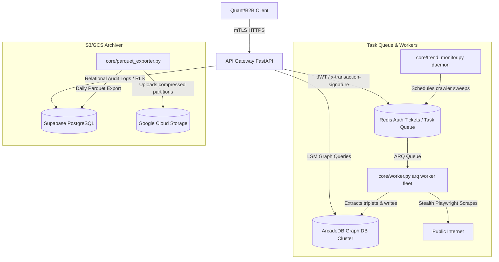

# Dubstrata Deployment Specification

This document outlines deployment configurations, container architecture, production dependencies, environment variables, and credential provisioning matrices for the Dubstrata API Gateway and background worker nodes.

---

## 1. Container & Deployment Topology

In production, Dubstrata is orchestrated using Docker Compose or Kubernetes, separating the API gateway, caching servers, database nodes, and background task queues.

---

## 2. Docker Compose Production Manifest

File: [docker-compose.yml](file:///c:/Users/muzik/Documents/GitHub/dubstrata/docker-compose.yml)

The base infrastructure defines three key service clusters:
1. **arcadedb:** Persistent graph database listening on HTTP port `8582`. Configured with root credentials and mapped to a volume to ensure transactional persistence.
2. **redis:** In-memory caching and queuing service listening on port `6379`. Handles ephemeral tickets (`ws_ticket:...`), connection throttling counters (`ws_active_conn:...`), and background job tasks.
3. **dubstrata-api / trend-monitor:** Python runtimes driving API requests and scheduling workers.

---

## 3. Configuration Matrix (.env)

The environment properties must be populated in the root `.env` file of all deployment hosts:

| Env Key | Description | Type / Example |
| :--- | :--- | :--- |
| `SUPABASE_URL` | Endpoint of the relational Supabase storage layer | URL |
| `SUPABASE_SECRET_KEY` | Admin service role key to bypass client RLS for background ingestion | Opaque Token |
| `SUPABASE_PUBLISHABLE_KEY` | Public client key used for basic client validation | Opaque Token |
| `REDIS_HOST` | Host address of the active Redis instance | String / `localhost` |
| `REDIS_PORT` | Listening port of the Redis instance | Integer / `6379` |
| `ARCADE_HOST` | Host address of the ArcadeDB instance | String / `localhost` |
| `ARCADE_PORT` | HTTP port of the ArcadeDB instance | Integer / `8582` |
| `ARCADE_USER` | Admin user account for ArcadeDB authorization | String / `root` |
| `ARCADE_PASSWORD` | Admin password for ArcadeDB authorization | String |
| `GOOGLE_APPLICATION_CREDENTIALS` | Path to JSON service account key file for GCS uploads | File Path |
| `GCS_BUCKET_NAME` | Destination GCS bucket name for Parquet archiving | String |
| `PORT` | Listening port for the API Gateway | Integer / `8000` |

---

## 4. Google Cloud Storage & Credentials Mapping

The `core/parquet_exporter.py` service archives daily alt-data partitions into high-performance Apache Parquet format and uploads them to Google Cloud Storage (GCS).

### Credentials Resolution Protocol
1. **Container Mapping:** Mount the JSON credentials file as a volume at `/app/data/gcs_credentials.json` inside the container.
2. **Path Normalization:** The system reads the environment variable `GOOGLE_APPLICATION_CREDENTIALS`. If the environment points to an absolute Windows path (e.g. `C:\Users\...`) while running inside Linux container boundaries, the telemetry service dynamically locates the filename within the container's locally mounted `/app/data/` or `/app/` directory and resets the variable.
3. **Local Mock Fallback:** If GCS credentials are not configured or missing, the system falls back to archiving partitions locally under `storage/gcs_mock/` to prevent pipeline blocks.
